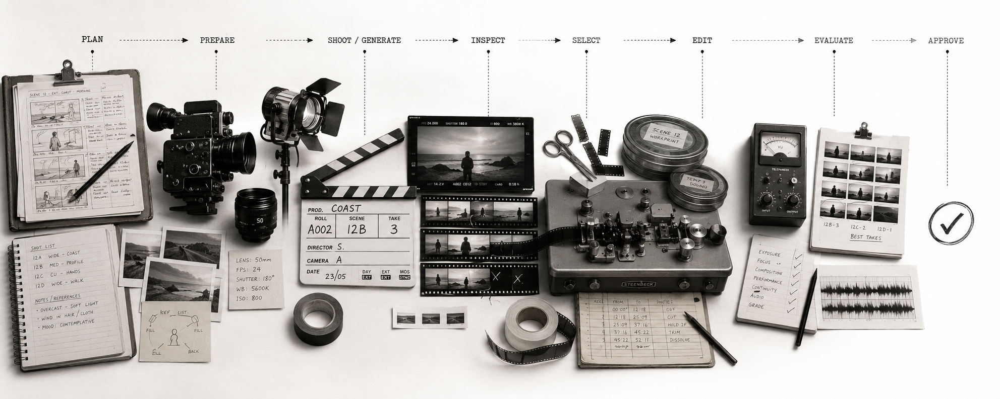

# Video Production Skills



**Direct AI video productions, not isolated generations.**

Video Production Skills gives AI coding agents a production workflow for turning a brief into a finished video.  

It supports the full production process:
- **Creative definition**: visual direction, character sheets and manifests, product manifests
- **Previsualisation**: storyboards, shot plans, animatics
- **Shot development**: reference frames, motion prototypes, video-shot production and selection
- **Editorial**: continuity, editing, audio integration
- **Finishing and delivery**: mastering and delivery variants
- **Quality**: evaluation, technical QC and targeted refinement. 

The workflow is designed to plan cheaply, approve creative decisions, preserve continuity, select shots, edit, evaluate, and retry only what failed.

## Approval and cost control

Creative decisions are approved by you, not by the agent.

- **Selection is the agent's.** It may advance an artifact to `selected` — "keep developing this".
- **Approval is yours.** Only you move an artifact to `approved` or `locked`, and the approver is recorded in `approvedBy`. An artifact marked approved with nobody recorded as approving it is treated as unapproved, and `tools/validate-production.ts` reports it.

Approval is requested before expensive generation for visual direction, character and identity references, environment references, the shot plan, and picture lock.

The agent asks before inventing a story-changing parameter it was not given — who the characters are, where the piece is set, which props carry meaning — because the cheapest representation that resolves a creative question is a question.

Retries and spend are bounded. When corrective attempts at one layer hit the agreed ceiling, or generation passes the agreed budget, the run stops and reports rather than escalating cost quietly.

## Install

```bash
npx skills add sb-dev/video-production-skills \
  --skill video-production \
  --skill video-evaluate \
  --agent claude-code
```

For the default image/video execution path:

```bash
npx skills add replicate/skills \
  --skill find-models \
  --skill compare-models \
  --skill prompt-images \
  --skill prompt-videos \
  --skill run-models \
  --agent claude-code
```

For Codex: use `--agent codex` instead.

Set `REPLICATE_API_TOKEN` when generation is required.

## Quick start — Mechanical Watch Hero


Start with one shot and learn the core production loop.

```text
Use video-production to create a 6-second luxury product hero shot.

Create a cinematic macro video of a black mechanical wristwatch resting on a brushed metal surface. The shot should feel premium, controlled, and elegant.

Requirements:
- Duration: 6 seconds
- Format: 16:9
- Tone: luxury commercial
- Subject: one black mechanical watch with a detailed dial, polished case, and visible texture on the strap
- Camera: slow, precise push-in with a subtle lateral move
- Lighting: dark studio environment with a narrow moving highlight sweeping across the watch face and case
- Focus: preserve crisp dial details, indices, hands, reflections, and premium material feel
- Background: minimal, dark, unobtrusive
- Motion: no chaotic movement; everything should feel controlled and intentional

Workflow:
- Establish concise visual direction first
- Create a reference frame before final video generation
- Generate at least two shot candidates
- Select the strongest candidate
- Run evaluation and technical QC

What to optimise for:
- premium product fidelity
- reflection control
- readable dial details
- smooth camera motion
- elegant lighting transition
```

A one-shot project should stay small:

```text
production/video/
├── brief.md
├── references/
├── shots/shot-001/
│   ├── reference-frame.png
│   ├── candidates/
│   ├── selection.json
│   └── provenance.json
├── master/video-master.mp4
└── evaluation/
```

The important behaviour is:

```text
cheap checkpoint → approve → generate → evaluate → refine only what failed
```

## Learn by producing

Progress through increasingly demanding productions. Each adds a real production problem, not another abstraction.

### Level 1 — Control one shot

**6s single shots**

Learn candidates, selection, refinement, and QC. Each example folder holds the prompt, the generated files, and an explanation of what happened.

<!-- Replace preview.gif files after each production run -->

| [](examples/level-1-mechanical-watch-hero/README.md) | [](examples/level-1-midnight-espresso/README.md) |
|---|---|
| **[Mechanical Watch Hero](examples/level-1-mechanical-watch-hero/README.md)** — luxury product hero | **[Midnight Espresso](examples/level-1-midnight-espresso/README.md)** — food/product commercial |
| [](examples/level-1-last-train-portrait/README.md) | [](examples/level-1-boxer-at-dawn/README.md) |
| **[Last Train Portrait](examples/level-1-last-train-portrait/README.md)** — cinematic character shot | **[Boxer at Dawn](examples/level-1-boxer-at-dawn/README.md)** — sports-action shot |

### Level 2 — Make shots work together

**12–15s three-shot sequences**

Learn character continuity, storyboard, shot planning, and editing.

<!-- Replace preview.gif files after each production run -->

| [](examples/level-2-last-train-home/README.md) | [](examples/level-2-missed-connection/README.md) |
|---|---|
| **[Last Train Home](examples/level-2-last-train-home/README.md)** — three-shot character sequence | **[Missed Connection](examples/level-2-missed-connection/README.md)** — two-character near miss |
| [](examples/level-2-the-red-umbrella/README.md) | [](examples/level-2-the-letter/README.md) |
| **[The Red Umbrella](examples/level-2-the-red-umbrella/README.md)** — colour-anchor tracking sequence | **[The Letter](examples/level-2-the-letter/README.md)** — restrained prop drama |

Adds `visual-direction.md`, `storyboard/`, `shot-plan.json`, and `edit/`.

### Level 3 — Produce a commercial

**15s commercials with audio and delivery variants**

Learn product fidelity, graphics, audio, and delivery variants.

<!-- Replace preview.gif files after each production run -->

| [](examples/level-3-obsidian-no-7/README.md) | [](examples/level-3-arc-one/README.md) |
|---|---|
| **[Obsidian No. 7](examples/level-3-obsidian-no-7/README.md)** — luxury fragrance | **[Arc One](examples/level-3-arc-one/README.md)** — wireless headphones |
| [](examples/level-3-apex/README.md) | [](examples/level-3-ember/README.md) |
| **[Apex](examples/level-3-apex/README.md)** — running shoe | **[Ember](examples/level-3-ember/README.md)** — espresso machine |

Adds product references/manifests, `graphics/`, `audio/`, and `delivery/`.

### Level 4 — Direct a short

**30–45s multi-sequence micro-films**

Learn shared references, sequences, animatics, and editorial iteration.

<!-- Replace preview.gif files after each production run -->

| [](examples/level-4-signal-lost/README.md) | [](examples/level-4-night-courier/README.md) |
|---|---|
| **[Signal Lost](examples/level-4-signal-lost/README.md)** — sci-fi micro-film | **[Night Courier](examples/level-4-night-courier/README.md)** — urban action micro-film |
| [](examples/level-4-the-last-light/README.md) | [](examples/level-4-room-417/README.md) |
| **[The Last Light](examples/level-4-the-last-light/README.md)** — atmospheric storm short | **[Room 417](examples/level-4-room-417/README.md)** — suspense micro-film |

Adds `shared/` references and `sequences/` when a flat shot list stops scaling.

### Level 5 — Run a video campaign

**Hero film + product film + social + bumper**

Learn multiple productions and cross-domain handoffs.

<!-- Replace preview.gif files after each production run -->

| [](examples/level-5-aster/README.md) | [](examples/level-5-nova/README.md) |
|---|---|
| **[Aster](examples/level-5-aster/README.md)** — electric motorcycle campaign | **[Nova](examples/level-5-nova/README.md)** — AR glasses campaign |
| [](examples/level-5-helios/README.md) | [](examples/level-5-atlas-one/README.md) |
| **[Helios](examples/level-5-helios/README.md)** — home robot campaign | **[Atlas One](examples/level-5-atlas-one/README.md)** — adventure e-bike campaign |

At this level the project can compose other Creative Production Skills through artifacts:

```text
production/
├── advertising/   # audience, proposition, claims
├── narrative/     # story and scenes
├── music/         # composition and master
└── video/         # visual production and video masters
```

## Project structure grows with the work

**One shot**  
Use `brief`, `references`, `shots`, `master`, and `evaluation`.

**Shots must work together**  
Add `visual-direction`, `storyboard`, `shot-plan`, and `edit`.

**Product, audio, or delivery matter**  
Add manifests, `graphics`, `audio`, and `delivery`.

**A flat shot list stops scaling**  
Add `shared` and `sequences`.

**Several distinct videos share assets**  
Use `video/shared` and `video/productions`.

**Other creative domains contribute**  
Use `production/{advertising,narrative,music,video}`.

Keep the structure lean:

- a shot is the smallest retryable production unit;
- selections point to candidates instead of copying them into `selected/` folders;
- lifecycle state lives in artifact metadata, not global `draft/approved/final` trees;
- `shared/` exists only for genuinely shared artifacts;
- masters stay separate from delivery variants.

## Skills

### `video-production`

Plan, draft, generate, select, edit and finish video while preserving approved decisions.

### `video-evaluate`

Diagnose the failure layer and recommend the smallest corrective action.

Evaluation is actionable rather than just a score:

```text
wrong composition      → revise reference frame or affected shot
wrong camera movement  → revise shot plan and affected shot
good shots, poor pace  → revise edit
corrupt media          → fail technical QC
```

## Execution

The skills decide **what production work is needed**. Existing tools execute it.

- **Replicate Agent Skills** — default image/video model discovery and execution
- **ElevenLabs Agent Skills** — optional speech, transcription and sound effects
- **FFmpeg / ffprobe** — assembly, inspection and QC
- **ImageMagick** — deterministic image operations
- **fal.ai / genmedia** — optional secondary execution path

Deterministic scripts are TypeScript and target **Node.js 24.12+**.

> **Use the least expensive representation that can resolve the current production uncertainty.**
>
> **Preserve approved decisions and change only what needs to change.**

## Documentation

### Specifications

- [Creative Skills System Specification](docs/01-creative-skills-system-spec.md)
  - [Core Principles](docs/01-creative-skills-system-spec.md#5-core-principles)
  - [High-Level Production Model](docs/01-creative-skills-system-spec.md#8-high-level-production-model)
  - [Core Skills](docs/01-creative-skills-system-spec.md#9-core-skills)
  - [Execution Architecture](docs/01-creative-skills-system-spec.md#10-execution-architecture)
  - [Production State](docs/01-creative-skills-system-spec.md#11-production-state)
  - [Build Order](docs/01-creative-skills-system-spec.md#19-build-order)
  - [System Acceptance Criteria](docs/01-creative-skills-system-spec.md#22-system-acceptance-criteria)
- [Creative Skills Workflows and Artifacts Specification](docs/02-creative-skills-workflows-and-artifacts-spec.md)
  - [Production Model](docs/02-creative-skills-workflows-and-artifacts-spec.md#2-production-model)
  - [State Model](docs/02-creative-skills-workflows-and-artifacts-spec.md#3-state-model)
  - [Draft Strategy](docs/02-creative-skills-workflows-and-artifacts-spec.md#4-draft-strategy)
  - [First-Class Artifacts](docs/02-creative-skills-workflows-and-artifacts-spec.md#6-first-class-artifacts)
  - [Editorial Workflow](docs/02-creative-skills-workflows-and-artifacts-spec.md#18-editorial-workflow)
  - [Evaluation Lifecycle](docs/02-creative-skills-workflows-and-artifacts-spec.md#26-evaluation-lifecycle)
  - [Failure Taxonomy](docs/02-creative-skills-workflows-and-artifacts-spec.md#30-failure-taxonomy)
  - [Core Workflows](docs/02-creative-skills-workflows-and-artifacts-spec.md#32-core-workflows)
- [Creative Skills Repository and Contracts Specification](docs/03-creative-skills-repository-and-contracts-spec.md)
  - [Canonical Repository Structure](docs/03-creative-skills-repository-and-contracts-spec.md#2-canonical-repository-structure)
  - [`video-production/SKILL.md` Contract](docs/03-creative-skills-repository-and-contracts-spec.md#9-video-productionskillmd-contract)
  - [`video-evaluate/SKILL.md` Contract](docs/03-creative-skills-repository-and-contracts-spec.md#10-video-evaluateskillmd-contract)
  - [Eval Requirements](docs/03-creative-skills-repository-and-contracts-spec.md#13-eval-requirements)
  - [Installation Expectations](docs/03-creative-skills-repository-and-contracts-spec.md#19-installation-expectations)
  - [Technical Acceptance Criteria](docs/03-creative-skills-repository-and-contracts-spec.md#26-technical-acceptance-criteria)

### Process and reports

- [New Project Bootstrap Process](docs/2026-08-20-creative-production-skills-new-project-bootstrap-process.md)
  - [Governing Principles](docs/2026-08-20-creative-production-skills-new-project-bootstrap-process.md#3-governing-principles)
  - [Bootstrap Flow](docs/2026-08-20-creative-production-skills-new-project-bootstrap-process.md#4-bootstrap-flow)
  - [Generate the Three Canonical Specs](docs/2026-08-20-creative-production-skills-new-project-bootstrap-process.md#13-stage-9--generate-the-three-canonical-specs)
  - [Canonical Installation Mechanism](docs/2026-08-20-creative-production-skills-new-project-bootstrap-process.md#17-canonical-installation-mechanism)
  - [Scaffold Acceptance Gate](docs/2026-08-20-creative-production-skills-new-project-bootstrap-process.md#26-scaffold-acceptance-gate)
  - [Publication Acceptance Gate](docs/2026-08-20-creative-production-skills-new-project-bootstrap-process.md#27-publication-acceptance-gate)
- [Extraction Candidates](docs/2026-08-20-extraction-candidates.md)
  - [Candidate Register](docs/2026-08-20-extraction-candidates.md#2-candidate-register)
  - [Explicit Non-Candidates](docs/2026-08-20-extraction-candidates.md#3-explicit-non-candidates)
  - [Review Trigger](docs/2026-08-20-extraction-candidates.md#4-review-trigger)

### Skills

- [Video Production](skills/video-production/SKILL.md)
- [Video Evaluate](skills/video-evaluate/SKILL.md)

### Evals

- [End-to-End Evals](evals/end-to-end/README.md)

### Examples

- Level 1 — Control one shot
  - [Mechanical Watch Hero](examples/level-1-mechanical-watch-hero/README.md)
  - [Midnight Espresso](examples/level-1-midnight-espresso/README.md)
  - [Last Train Portrait](examples/level-1-last-train-portrait/README.md)
  - [Boxer at Dawn](examples/level-1-boxer-at-dawn/README.md)
- Level 2 — Make shots work together
  - [Last Train Home](examples/level-2-last-train-home/README.md)
  - [Missed Connection](examples/level-2-missed-connection/README.md)
  - [The Red Umbrella](examples/level-2-the-red-umbrella/README.md)
  - [The Letter](examples/level-2-the-letter/README.md)
- Level 3 — Produce a commercial
  - [Obsidian No. 7](examples/level-3-obsidian-no-7/README.md)
  - [Arc One](examples/level-3-arc-one/README.md)
  - [Apex](examples/level-3-apex/README.md)
  - [Ember](examples/level-3-ember/README.md)
- Level 4 — Direct a short
  - [Signal Lost](examples/level-4-signal-lost/README.md)
  - [Night Courier](examples/level-4-night-courier/README.md)
  - [The Last Light](examples/level-4-the-last-light/README.md)
  - [Room 417](examples/level-4-room-417/README.md)
- Level 5 — Run a video campaign
  - [Aster](examples/level-5-aster/README.md)
  - [Nova](examples/level-5-nova/README.md)
  - [Helios](examples/level-5-helios/README.md)
  - [Atlas One](examples/level-5-atlas-one/README.md)

## Contributing

See [`CONTRIBUTING.md`](CONTRIBUTING.md).

## License

Apache-2.0. See [`LICENSE`](LICENSE).
